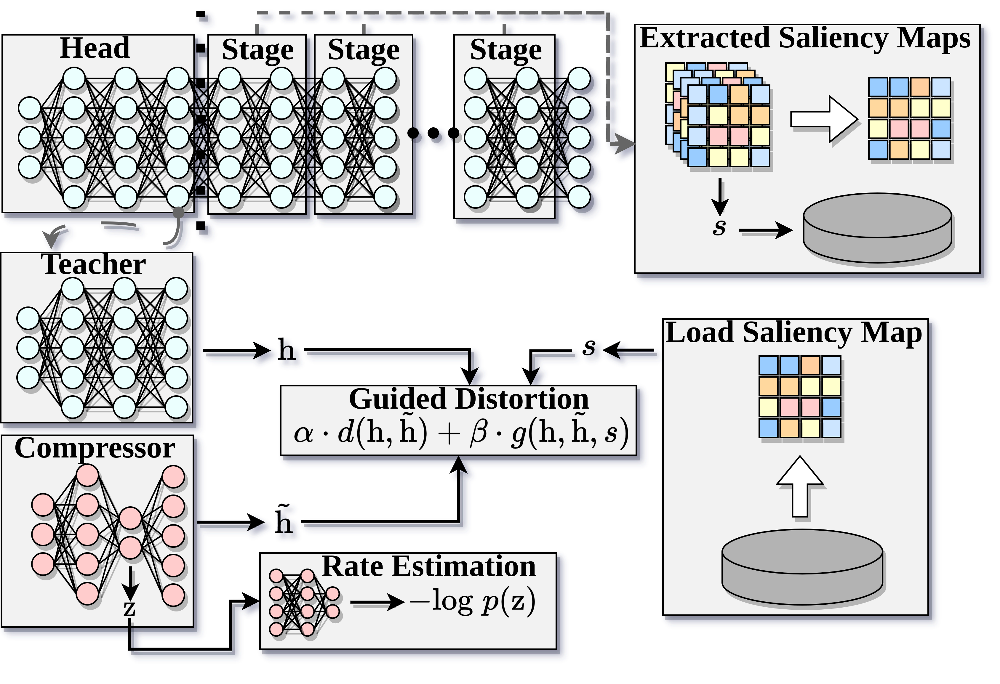

# Mantis

Author: Jared Macshane (PhD student at UCI)

Official Repository for the paper on Mantis: Efficient Neural Feature Compression with Shallow Variational Bottleneck
Injection for Mobile Edge Computing

If you find this work interesting, please check the [follow up ](https://github.com/rezafuru/the-fool)

## Setup

1. Create virtual environment and install dependencies (requirements.txt). 
    2. Optionally: Install cupy for (significantly) faster cam map generation. The required package depends on your cuda version and you can find more information [here](https://docs.cupy.dev/en/stable/install.html). 
2. Download the ImageNet dataset (We cannot directly link to it) and execute the script below
```shell
wget https://image-net.org/data/ILSVRC/2012/ILSVRC2012_img_train.tar ./
wget https://image-net.org/data/ILSVRC/2012/ILSVRC2012_img_val.tar ./
mkdir ~/dataset/ilsvrc2012/{train,val} -p
mv ILSVRC2012_img_train.tar ~/resources/datasets/ilsvrc2012/train/
mv ILSVRC2012_img_val.tar ~/resources/datasets/ilsvrc2012/val/
cd ~/resources/datasets/ilsvrc2012/train/
tar -xvf ILSVRC2012_img_train.tar
mv ILSVRC2012_img_train.tar ../
for f in *.tar; do
  d=`basename $f .tar`
  mkdir $d
  (cd $d && tar xf ../$f)
done
rm -r *.tar
cd ../../../../../

wget https://raw.githubusercontent.com/soumith/imagenetloader.torch/master/valprep.sh
mv valprep.sh ~/resources/datasets/ilsvrc2012/val/
cd ~/resources/datasets/ilsvrc2012/val/
tar -xvf ILSVRC2012_img_val.tar
mv ILSVRC2012_img_val.tar ../
sh valprep.sh
mv valprep.sh ../
cd ../../../../../
```
3. Set PYTHONPATH as repository root
4. Optional: For saliency guided distortion create CAM maps: `python saliency_maps/cam_prep/cam_map_generation.py --model swin_s3_base_224 --input ~/resources/datasets/ilsvrc2012/train --output resources/dataset/tmp --batch_size 16 --device cuda:0 --mix_layers --saliency_type XGradCAM  --eigen_smooth --patch_cam --target_dim 28`
   4. Set batch size as memory permitting
   5. The models are loaded from torch image models (timm). You can replace swin_s3_base_224 with other target models that are present in the timm registry.
   6. To pass custom weights for a timm model use --weights_path `path/to/weights`
   7. There are some other options, but they are not relevant to the experiments in the paper
5. Optional: Download some pre-trained weights from: TODO
## Train & Test


To train from scratch: `python main_classification_torchdistill.py --config path/to/config --skip_ckpt` 

To test with pre-trained weights: `python main_classification_torchdistill.py --config path/to/config --test_only` (make sure that the weights are found)

## Using WebDatasets with Ceph Storage

This project now supports `webdataset` for reading data, which is particularly useful for large datasets stored in S3-compatible object storage like Ceph.

### YAML Configuration for WebDataset

To use WebDataset, you need to modify your dataset configuration in the YAML files. Change the `type` to `WebDataset` and provide the `url` to your dataset shards.

Example snippet from a YAML configuration:

```yaml
datasets:
  # ... other dataset definitions ...
  your_dataset_name:
    # ... other wrapper configs if any ...
    splits:
      train:
        dataset_id: 'your_dataset_name/train'
        params: 
          original_dataset: 
            type: 'WebDataset' # Use WebDataset
            params:
              url: 's3://YOUR_BUCKET/path/to/imagenet-train-{000000..000146}.tar' # URL to your data shards in Ceph/S3
              transform:
                _target_: misc.datasets.registry.parse_transform_config_list
                config:
                  # ... your list of transforms ...
      val:
        # ... similar configuration for validation set ...
```

### Environment Variables for S3/Ceph Access

For `webdataset` to access data from S3-compatible storage like Ceph, you need to set the following environment variables before running your scripts:

-   `AWS_ACCESS_KEY_ID`: Your S3 access key.
-   `AWS_SECRET_ACCESS_KEY`: Your S3 secret key.
-   `AWS_ENDPOINT_URL`: The S3 endpoint URL of your Ceph cluster (e.g., `http://your-ceph-s3-gateway.example.com:7480`).

Optionally, you might need to set these depending on your Ceph configuration:

-   `AWS_USE_SSL`: Set to `0` if your Ceph endpoint uses `http` (e.g., `AWS_USE_SSL=0`). Set to `1` if it uses `https` and this is not automatically detected.
-   `AWS_S3_ADDRESSING_STYLE`: This can be `path` or `virtual`. For many Ceph setups, `path` style is used. If you encounter issues, try setting `AWS_S3_ADDRESSING_STYLE=path`.

### Data URL Format

The `url` parameter in your YAML configuration should point to the tar files stored on your Ceph cluster. `webdataset` supports brace expansion for specifying multiple shards, for example: `s3://my-imagenet-bucket/train-shards/imagenet-train-{000000..001023}.tar`.

Additionally, wrapper classes such as `LabelChunkedTaskDataset` and `MultiSourceTaskDataset` have been enhanced. You can now specify `image_key` and `label_key` in their `params` in the YAML configuration. This allows them to correctly process data from underlying datasets (like WebDataset) that yield dictionaries (e.g., `{'image': tensor, 'label': tensor}`) instead of simple tuples.

## Notes
- I've removed most code that was out of scope to include in the paper to avoid confusion but there are still some
  references to unpublished implementations/results.  Specifically, this repository was created by extracing relevant parts into its own Repository. 
- This was the first time I worked on a large PyTorch project and it started with me hacking some ideas together. I've understimated, the scope and times things need to be updated and extended, so the repository is a bit of a mess. I'll clean things up iteratively and include more detailed instructions over time. For now, if you need my assistance with anything, feel free to write me a mail at a.furutanpey@dsg.tuwien.ac.at 
- Check out [torchdistill](https://github.com/yoshitomo-matsubara/torchdistill) (It's awesome!) for documentation on how
  configurations are loaded and how you can adjust them if you want to perform your own experiments


# Citation

[[IEEE]](https://ieeexplore.ieee.org/document/10480247) [[Preprint]](https://arxiv.org/abs/2302.10681)

```bibtex
@ARTICLE{10480247,
  author={Furutanpey, Alireza and Raith, Philipp and Dustdar, Schahram},
  journal={IEEE Transactions on Mobile Computing}, 
  title={Mantis: Efficient Neural Feature Compression With Shallow Variational Bottleneck Injection for Mobile Edge Computing}, 
  year={2024},
  volume={23},
  number={12},
  pages={10770-10786},
  keywords={Runtime;Computational modeling;Load modeling;Task analysis;Bandwidth;Servers;Image coding;Split computing;distributed inference;edge computing;edge intelligence;learned image compression;data compression;neural data compression;feature compression;knowledge distillation},
  doi={10.1109/TMC.2024.3381952}
}
```

# References

- Matsubara, Yoshitomo. "torchdistill: A modular, configuration-driven framework for knowledge distillation."
  Reproducible Research in Pattern Recognition: Third International Workshop, RRPR 2021, Virtual Event, January 11,
  2021, Revised Selected Papers. Cham: Springer International Publishing, 2021.
- Matsubara, Yoshitomo, et al. "SC2: Supervised compression for split computing." arXiv preprint arXiv:2203.08875 (
  2022).
- Wightman, Ross. "Pytorch image models." (2019).
- Bégaint, Jean, et al. "Compressai: a pytorch library and evaluation platform for end-to-end compression research."
  arXiv preprint arXiv:2011.03029 (2020).
- Gildenblat, Jacob. "contributors. Pytorch library for cam methods." (2021).
- Ballé, Johannes, et al. "Variational image compression with a scale hyperprior." arXiv preprint arXiv:1802.01436 (
  2018).
- Minnen, David, Johannes Ballé, and George D. Toderici. "Joint autoregressive and hierarchical priors for learned image
  compression." Advances in neural information processing systems 31 (2018).
